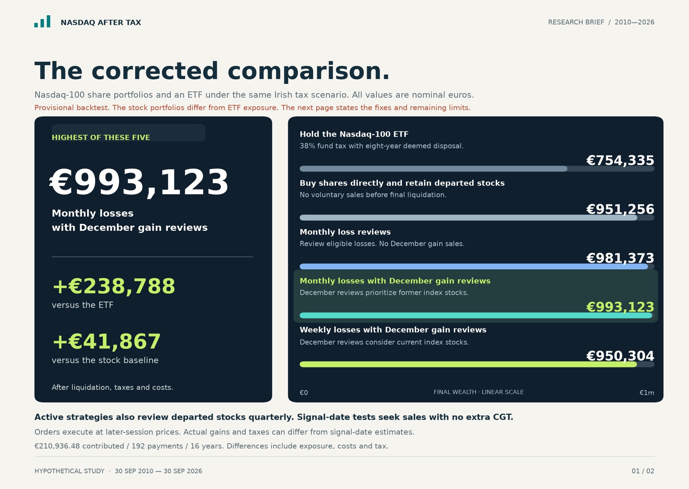
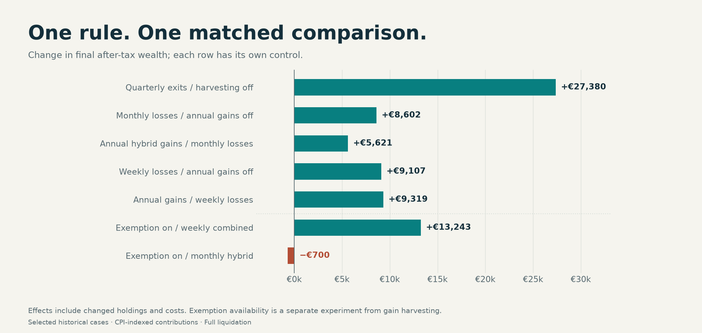

<div align="center">

# Nasdaq After Tax

**Recreate a Nasdaq-100 ETF with individual shares, manage and rebalance it ourselves, then compare the Irish tax outcome.**

Starts at €1,000/month · Annual Irish CPI reviews · 16 years · €210,936.48 contributed

[Read the report](historical/results/latest/report.pdf) · [Compare strategies](historical/results/latest/comparison.csv) · [Inspect marginal effects](historical/results/latest/marginal_effects.csv)

<sub>Python · Reproducible historical simulation</sub>

</div>

---

This project models **recreating a Nasdaq-100 ETF in our own brokerage account by buying the underlying company shares directly**. We aim to hold the full basket of index shares in the available target proportions, and take responsibility for buying, rebalancing, reinvesting dividends and managing sales ourselves. The comparison asks what an Irish investor keeps after tax versus simply buying an accumulating ETF.

**How we keep the portfolio close to the index:** use historical membership and target weights available at each date. New contributions, after-tax dividends and sale proceeds buy eligible current members below their target weights. New members become purchase targets once their weights are known; stocks that leave stop receiving new purchases. Each strategy below controls when holdings are sold, including for tax losses and the annual CGT exemption.

This is an approximate, self-managed replica. We allow holdings to drift instead of automatically selling every overweight stock to restore exact weights. Retained former members, purchase restrictions and missing data can leave differences or cash, so the model does not claim to own every constituent at every date.

**Results and transaction ledgers are hypothetical historical simulations.**

**Research only; not tax, legal or investment advice.** Read the [legal notice](#legal-notice) before relying on any material.

## What each strategy actually does

All five scenarios invest the same CPI-linked monthly contributions for 16 years, then sell everything. **The four share-based scenarios are different ways of managing the same attempted ETF replica**: they share the index-based buying rules above and differ in when they sell holdings.

| Strategy | Trading rule | Final after-tax wealth |
|:---|:---|---:|
| **Hold the ETF** | Buy an accumulating ETF; pay the modelled tax at each purchase’s eight-year anniversaries and on final sale. | **€750,729** |
| **Buy index shares; keep stocks that leave** | Buy current index shares with new money. Keep existing holdings, including former members; no discretionary sales before final liquidation. Compulsory corporate actions still apply. | **€952,619** |
| **Sell losing shares each month** | Each month, sell eligible holdings down at least **5% and €25**, then reinvest into current index stocks. No December sales to use unused tax capacity. | **€988,601** |
| **Sell losses monthly; sell former index stocks first in December** | Add December sales of profitable former members, putting proceeds into current index stocks. If tax capacity remains, sell and rebuy eligible current stocks. | **€994,222** |
| **Sell losses weekly; sell and rebuy current stocks in December** | Check losses each Friday. In December, sell and rebuy eligible current index stocks to realise gains without adding CGT at that review. | **€998,425** |

**Shared by the three strategies that sell losses:** review former index members every quarter and sell a whole holding only when it adds no current-year CGT; reinvest proceeds into current index stocks. Otherwise, keep it. Both monthly and weekly loss reviews use the **5% and €25** thresholds and the model’s 29-day purchase restrictions.

**The December rule:** try to realise gains covered first by available losses, then by the remaining **€1,270 annual CGT exemption**. It is not a €1,270 cap on gross gains, and eligible holdings may prevent full use. The monthly version sells former members first; the weekly version’s December sales are confined to current index stocks. Selling and rebuying records a new purchase cost for future CGT while keeping those stocks, with fewer shares after fees.



The strongest selected result was **€998,425**. Adding December sales and repurchases to the otherwise identical weekly-loss strategy increased final wealth by **€9,319**; additional nominal exemption relief was **€5,948**. Those are different measures, not amounts to add together.

These three strategies were selected from an earlier, broader exploration with fixed contributions and rerun with CPI-linked funding. **Selection is retrospective**; using only information available at each trade does not make this an out-of-sample test.

## Why direct ownership changes the tax comparison

The model assumes an Irish-resident individual investing personally in ordinary company shares, compared with an accumulating Irish-domiciled ETF within the investment-fund tax regime. ETF classification and personal circumstances matter; this is not a rule for every product called an ETF.

| Tax question | Own the individual company shares | Own the accumulating ETF modelled here |
|:---|:---|:---|
| **Tax on gains** | Generally **33% CGT** on taxable realised gains, after allowable costs, losses and reliefs. | **38% fund tax** is the comparison assumption for taxable gains. |
| **Hold without selling** | Ordinary shares have **no eight-year deemed disposal**. Tax can still arise on dividends or other taxable events. | Gains can be taxed at each **eight-year anniversary of a purchase**, even without a sale. Earlier deemed-disposal tax is credited when calculating subsequent tax due. |
| **Annual exemption** | The **€1,270 personal CGT exemption** can shelter net gains each tax year. It is shared across the person's eligible gains, not available separately for every stock. | The ordinary €1,270 CGT exemption does not apply to this fund-tax regime. |
| **Loss harvesting** | Allowable realised losses can offset chargeable capital gains, with unused allowable losses carried forward. Share-matching and four-week repurchase restrictions matter. | No ordinary CGT loss netting against gains on other investments; credit or repayment of earlier deemed-disposal tax is a separate mechanism. |
| **Dividends** | Dividends are generally subject to Income Tax, USC and PRSI as applicable, even if reinvested. Foreign withholding and available tax credits must also be considered. | The accumulating fund retains its underlying income. Fund-level taxes affect NAV; investor-level fund tax is modelled on disposal and deemed disposal. |
| **Rebalancing** | Selling shares to follow index changes can realise taxable gains. The investor controls discretionary sales. | Trading inside the fund does not itself dispose of the investor's ETF units. Selling those units can trigger fund tax. |

Sources: Revenue's [CGT calculation and exemption](https://www.revenue.ie/en/gains-gifts-and-inheritance/transfering-an-asset/how-to-calculate-cgt.aspx), [share-disposal rules](https://www.revenue.ie/en/gains-gifts-and-inheritance/transfering-an-asset/selling-or-disposing-of-shares.aspx), [dividend guidance](https://www.revenue.ie/en/additional-incomes/dividend-income/index.aspx) and [investment-undertaking guidance](https://www.revenue.ie/en/tax-professionals/tdm/income-tax-capital-gains-tax-corporation-tax/part-27/27-01a-02.pdf).

The 38% fund rate applies from [1 January 2026](https://www.revenue.ie/en/tax-professionals/ebrief/2026/no-0162026.aspx). The study freezes its tax assumptions across the comparison period; it does not reconstruct each year's legislation. The 52.35% dividend-tax assumption is one modelled Income Tax/USC/PRSI scenario, not the rate for every higher-rate taxpayer.

The strategies test whether managing sales, harvesting eligible losses and using available annual CGT exemption can improve final after-tax wealth. Direct ownership also brings dividend taxes, trading costs, tracking differences and more record-keeping. All of those affect the comparison; a harvested loss is not an immediate cash refund, and a lower tax bill does not necessarily mean a better investment outcome.

## Contributions that follow Irish inflation

Monthly contributions start at **€1,000 in September 2010**. At each subsequent September review, the new monthly amount is **€1,000 × that August’s Irish all-items CPI ÷ August 2010 CPI (101.9)**, using the same December 2006 reference base. The August index must have been published before the review date. Round the result to cents and hold it through the following August; both inflation and deflation apply.

The 15 annual reviews produce **€210,936.48 across 192 contributions**, ending at **€1,301.28 per month** for September 2025–August 2026. The schedule includes reductions in September 2016 and September 2020. Every strategy uses the same scheduled amounts and dates; stock contributions scheduled for 30 March 2018, 31 May 2021 and 29 March 2024 post on the next available stock-market session.

These are **nominal euro results**, not final wealth expressed in constant purchasing power. This schedule invests **€18,936.48 more** than the earlier fixed-€1,000 study, so changes from that study’s final balances also reflect different cash contributions.

Source: CSO Ireland’s [CPM02 national CPI series](https://data.cso.ie/table/CPM02). The [contribution schedule](historical/results/latest/contribution_schedule.csv) records each payment, reference index and publication date. The [CPI methodology and provenance](historical/inflation/README.md) explain rounding and the current official snapshot: historical release dates are checked, but archived API vintages are not reconstructed.

## What is the tax optimisation actually worth?



Each bar compares two complete replays that differ in one rule. Additional diagnostic controls isolate departure management, loss harvesting, annual gain harvesting and the availability of the annual exemption.

These distinctions matter:

- **Final wealth change** includes taxes, costs, reinvestment and changes in which stocks were held. It is not all tax savings.
- **Nominal exemption relief** is the exemption actually used, multiplied by 33%. It is an accounting measure, not an extra amount to add to the final balance.
- **Gain harvesting and the annual exemption are different experiments.** Gain reviews use existing losses before the allowance and change acquisition costs; separate exemption-off replays test the allowance’s availability.
- **Do not add effects measured against different controls.** Resetting a share’s tax basis changes later loss opportunities, while using a loss bank can change whether a departed holding is sold. The [interaction table](historical/results/latest/interactions.csv) measures that dependence. Differences along a consistent sequence of controls do sum correctly.

Harvesting a loss does not automatically create a permanent benefit equal to the loss times the tax rate. Replacement shares can have a lower cost basis and a larger taxable gain later. The relevant outcome is wealth after all taxes and costs.

The exemption-on/off sensitivities illustrate the feedback. With the exemption available, the weekly strategy finishes **€13,243 higher**, with **€6,368** of nominal exemption relief. The strategy that sells losses monthly and former members first in December finishes **€700 lower**, despite **€6,787** of nominal exemption relief and lower CGT. These wealth changes include altered holdings and cash deployment; neither is a measure of allowance tax savings alone.

## How the three stock strategies trade

| Review | Common execution rules |
|:---|:---|
| **Monthly contributions** | Invest the scheduled CPI-indexed amount into eligible current constituents below their dated target weights. Reinvest dividends after tax. |
| **Loss harvesting** | Sell a whole eligible holding only when its euro loss after fees reaches **both 5% and €25**. Require no same-class purchase in the preceding 29 days, then block repurchase for 29 days. |
| **Quarterly sales of former members** | Sell a whole holding only when known realised losses, carried losses and the available exemption cover the gain without increasing CGT at that review. Otherwise keep it. |
| **December sales, where enabled** | Sell the oldest shares first, including partial holdings, to use existing losses and then remaining **€1,270 annual exemption** capacity. Immediate repurchases of current stocks require every selected lot to be non-losing and incur costs on both trades. |
| **Final liquidation** | Sell all remaining holdings using required terminal quotes and settle remaining modelled taxes and costs. |

Decisions use the information available at the review; they do not anticipate later losses, recoveries or index changes.

## Previously weak rules, tested again

These were the three weakest active gain-harvesting variants in the earlier fixed-contribution exploration, excluding controls and extra-spread sensitivities. They are now rerun with CPI-indexed contributions on the same corrected market data. All three still trail their matched controls, although their order has changed. Each shortfall below is measured against an otherwise matched strategy, rather than against the historical winner.

| Underperforming rule | Final after-tax wealth | Matched comparator | Shortfall |
|:---|---:|:---|---:|
| Sell losing shares monthly from a €1 loss | €972,752 | Same rules, but require a 5% and €25 loss; both sell and rebuy current stocks in December | −€22,369 |
| Keep former members; sell and rebuy current stocks in December; no loss sales | €956,852 | Same rules, but also sell former members quarterly when no extra CGT arises | −€26,624 |
| Sell and rebuy profitable current stocks monthly | €957,621 | Same rules, but sell and rebuy in December only | −€37,500 |

- **Harvesting tiny losses created much more activity without improving the net outcome.** Loss sales rose from 424 to 1,403, while realised losses increased by €2,041. Recorded costs rose by €741, while nominal exemption relief fell by €120. Changed holdings, replacement purchases and cash deployment also affected returns; the fees alone do not explain the €22,369 shortfall.
- **Keeping departed holdings preserved exposure that underperformed on this path.** Average confirmed outside-index weight was 4.71%, versus 0.21% when former members could be sold quarterly without extra CGT. This version paid €12,925 less total tax and €236 less in recorded costs, yet finished €26,624 behind. It still beat the plain retained-stock baseline by €4,234: December sales and repurchases helped in that comparison, but did not make retention the better rule.
- **Monthly gain reviews did not create a larger annual allowance.** They produced 720 gain sales versus 198, with €80 less nominal exemption relief. Earlier basis resets and use of tax capacity changed later loss and departure decisions. The portfolio paid less tax but also generated less wealth; this was not simply a transaction-fee problem.

These observations explain the recorded differences, not a universal claim that a strategy can never work. The study does not establish which particular missed recoveries caused the shortfalls. [Underperformer results](historical/results/latest/underperformers.csv) include the controls, trade counts, tax and cost differences; the [independent audit](historical/results/latest/attribution_audit.json) reconciles the accounting changes.

## Read and reproduce

| Artifact | Contents |
|:---|:---|
| [Current report](historical/results/latest/report.pdf) | Four-page visual brief: results, marginal gains, trading rules and assumptions. |
| [Contribution schedule](historical/results/latest/contribution_schedule.csv) | All 192 payments, annual reviews, CPI observations and publication dates. |
| [Irish CPI inputs](historical/inflation/README.md) | Official source, funding formula, vintage limitations and provenance links. |
| [Headline comparison](historical/results/latest/comparison.csv) | ETF, baseline and three selected stock strategies. |
| [Matched effects](historical/results/latest/marginal_effects.csv) | Complete-control wealth differences, CGT changes, exemption relief and costs. |
| [Previously weak variants](historical/results/latest/underperformers.csv) | The selected variants replayed with CPI-indexed funding, their matched comparators and explanatory evidence. |
| [Tax relief](historical/results/latest/tax_relief.csv) | Actual exemption usage and realised loss-harvesting amounts. |
| [Annual tax ledger](historical/results/latest/annual_tax_and_exemptions.csv) | Year-by-year gains, losses, exemption use and carried losses. |
| [Study manifest](historical/results/latest/study_manifest.json) | Assumptions, selection caveats, freshness and input/code hashes. |
| [Policy definitions](historical/results/latest/policy_definitions.json) | Exact configurations for all stock replays and diagnostic controls. |
| [Independent ledger audit](historical/results/latest/independent_ledger_audit.json) | Cash, cost-basis, tax and trade-eligibility checks. |
| [Attribution audit](historical/results/latest/attribution_audit.json) | Checks that reported marginal effects and interactions match the underlying replays. |

Run from the repository root with the cached market inputs. The recorded environment uses **Python 3.14 on Linux**.

```bash
python3 -m venv .venv
source .venv/bin/activate
python -m pip install -r requirements.txt

# Rebuild the report and charts from the current saved results.
python historical/run_tax_optimization_report.py

# Replay the stock strategies, controls and ETF benchmark.
python historical/run_tax_optimization_study.py --workers 3
```

Parallel execution uses Unix `fork`; use `--workers 1` where it is unavailable or memory is constrained. Replaying is substantially slower than rendering and overwrites the current generated study outputs.

```bash
python -m unittest discover -s historical/model -p 'test_*.py'
python -m unittest discover -s historical/tax -p 'test_*.py'
python -m unittest discover -s historical -p 'test_contributions.py'
python historical/checks/independent_policy_checks.py
python historical/checks/independent_checks.py
python historical/checks/audit_ledgers.py
python historical/checks/check_attribution.py
```

<details>
<summary><strong>Project map</strong></summary>

```text
historical/
├── model/                         ETF and individual-share engines; tests
├── tax/                           Irish tax helpers; tests
├── checks/                        Independent economic and ledger checks
├── benchmark/                     Issuer ETF benchmark and source audits
├── inflation/                     Irish CPI observations and publication evidence
├── inputs/                        Dated weights, membership and metadata
├── membership/                    Membership evidence and source tooling
├── prices/                        Market data and corporate-action repairs
├── results/latest/                One current report, tables, charts and ledgers
├── contributions.py               Publication-aware annual CPI contribution schedule
├── study_inputs.py                Shared input preparation
├── run_tax_optimization_study.py   Focused comparison and matched controls
└── run_tax_optimization_report.py  Current report and charts
```

Acquisition and repair scripts are separate from replay engines. Refreshing source data can change results; review the associated provenance and assumptions.

</details>

## Sources and acknowledgements

This study uses Quantiacs market data and toolbox code, historical membership work by Jeff McCarrell and thuningxu, iShares and SEC-filed fund holdings, Yahoo Finance via yfinance, Nasdaq/FRED series, ECB exchange rates, [Irish CPI from the Central Statistics Office](https://data.cso.ie/table/CPM02), and issuer, Revenue and broker documentation. See [source credits and third-party notices](THIRD_PARTY_NOTICES.md) for authors, upstream revisions, retained licences and links to the detailed provenance records; the [CPI source notes](historical/inflation/README.md) include the CSO attribution and licence.

A [free-data replacement](historical/providers/README.md) is being evaluated using Tiingo and the public-domain WIKI archive. The candidate readers are separate from the active study: existing figures still use the sources above, and no completed migration or new publication clearance is claimed.

## Assumptions that change the interpretation

- **Horizon:** 30 September 2010 to 30 September 2026; 192 monthly contributions. The period touches 17 calendar tax years.
- **Funding:** €1,000 initially, reviewed each September using already-published August CPI, with decreases allowed. Total nominal outlay is €210,936.48; all portfolio outcomes are nominal euros. The final CPI observation used is August 2025, with no 2026 inflation estimate needed.
- **Data freshness:** corrected stock prices through 30 September 2026; ETF/FX source cache contains observations through 2 October. Last eligible target weights are dated 31 August and available 7 September. September weights were not yet available for September decisions.
- **Frozen taxes:** 33% stock CGT, €1,270 annual exemption, 52.35% marginal dividend tax and 38% ETF fund tax. These are hypothetical comparison assumptions, not each year’s historical law or a person’s tax status.
- **Relief:** current and carried losses precede the exemption; unused exemption expires. No unrelated gains consume the allowance. Dividend withholding credits are included.
- **Costs:** 0.15% FX per non-euro stock purchase and sale; no extra spread or slippage. ETF NAV includes fund expenses and fund-level withholding. Historical broker availability and execution quality are not certified.
- **Provisional reconstruction:** historical weights, delisted-stock dividends, corporate-action tax treatment and some successor valuations remain incomplete or approximate. Some unquoted holdings use explicit nontradable marks. Small performance differences deserve caution.

Share matching and immediate winner repurchases are documented modelling interpretations, not a Revenue ruling. See Revenue’s guidance on [CGT calculation and exemption](https://www.revenue.ie/en/gains-gifts-and-inheritance/transfering-an-asset/how-to-calculate-cgt.aspx) and [share disposals](https://www.revenue.ie/en/gains-gifts-and-inheritance/transfering-an-asset/selling-or-disposing-of-shares.aspx).

## Legal notice

**Research and educational use; Irish-law notice.** Nasdaq After Tax, including its source code, datasets, simulations, reports and documentation (the “Materials”), is made available without charge for general research and educational purposes. Nothing in the Materials is intended to constitute tax, legal, accounting or investment advice, a personalised recommendation, or an offer or solicitation to acquire or dispose of any investment. Publication, access or use does not, of itself, establish an adviser–client, fiduciary or other professional relationship with the authors, maintainers or contributors.

**Independent assessment.** The Materials do not take account of your circumstances. Independently verify their information and obtain advice from appropriately qualified professionals before making investment decisions, adopting a tax strategy or preparing a tax return. You remain responsible for your decisions and for complying with applicable tax and legal obligations.

**No assurance of outcomes.** Results are hypothetical historical simulations, subject to assumptions, data limitations and possible errors. They are not promises of future performance or confirmation that a tax treatment will be accepted by the Irish Revenue Commissioners or a court. Laws, guidance and market conditions may change.

**Disclaimer of warranties and limitation of liability.** To the fullest extent permitted by applicable law, the Materials are provided “as is” and “as available”, without warranties concerning accuracy, completeness, currency, suitability or fitness for a particular purpose. Subject to the following paragraph, the authors, maintainers and contributors exclude liability, whether in contract, tort (including negligence) or otherwise, arising from use of or reliance on the Materials, including investment losses, tax liabilities, penalties, interest and loss of data.

**Mandatory rights preserved.** Nothing in this notice excludes or limits liability for fraud or fraudulent misrepresentation, death or personal injury caused by negligence, or any liability that cannot lawfully be excluded or limited. Mandatory statutory rights and remedies, including applicable consumer protections, are preserved.

**Applicable law.** Insofar as a choice of law is legally effective, this notice is governed by Irish law. It does not displace mandatory protections under another applicable law or restrict any right to bring proceedings before a court having jurisdiction under mandatory law.
